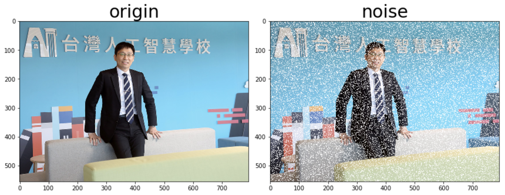

# Side-Window-Filtering-Python
* Python implementation of [CVPR 2019 Oral paper Side Window Filtering](https://arxiv.org/pdf/1905.07177.pdf)

# Usage
* Download python file SideWindowFilter.py

```python
import cv2
from SideWindowFilter import SideWindowFiltering_3d

img = cv2.imread('aiaceo.jpg')
swf_img = SideWindowFiltering_3d(img, kernel=3, mode='mean')
```

* SWF_demo.ipynb demonstrate some examples

# DEMO

* Original image & Add salt noise image


