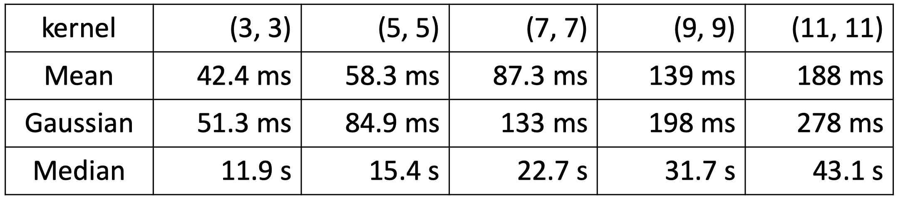

# Side-Window-Filtering-Python
* Python implementation of [CVPR 2019 Oral paper Side Window Filtering](https://arxiv.org/pdf/1905.07177.pdf)

# Usage
* Download python file SideWindowFilter.py

```python
import cv2
from SideWindowFilter import SideWindowFiltering_3d # for RGB image
from SideWindowFilter import SideWindowFiltering # for Gray image

img = cv2.imread('aiaceo.jpg')
swf_img = SideWindowFiltering_3d(img, kernel=3, mode='mean')

img = cv2.imread('aiaceo.jpg', 0)
swf_img = SideWindowFiltering(img, kernel=3, mode='mean')
```

* SWF_demo.ipynb demonstrate some examples

```python
swf_img = SideWindowFiltering_3d(img, 
                                 kernel=3, # 3, 5, 7, 9, 11, ...
                                 mode='mean', # 'mean', 'gaussian', 'median'
                                 use_big=False # False: 8 angles, True: 12 angles
                                 )
```

# Requirment

```python
import cv2
import numpy
import numba
```

* Mostly use basic function to implement, version of packages might not be a big deal.
* Use numba just-in-time to complie python code, otherwise it takes extremely long time when execution. 

# DEMO

* Original image & Add salt noise image


* 3x3 Mean Filtering by traditional method and SWF method


# Compare mean & gaussian & median

* Median filter takes much more time than mean filter
(There must exists more efficient way to implement it.)

  * Image size is 555 x 792
  * Run on Linux with Intel(R) Xeon(R) CPU E5-2667 v4 @ 3.20GHz



* Results by apply (5, 5) kernel size


